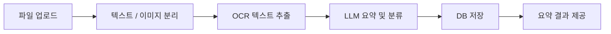
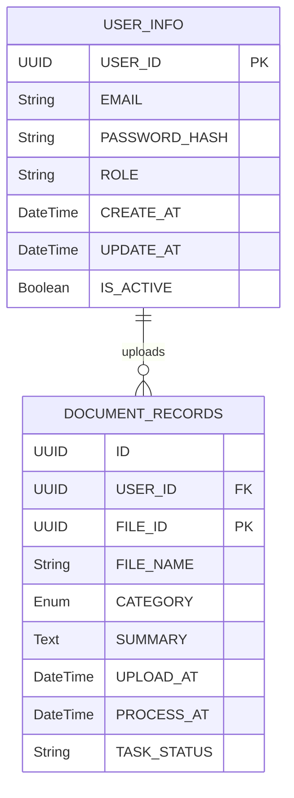
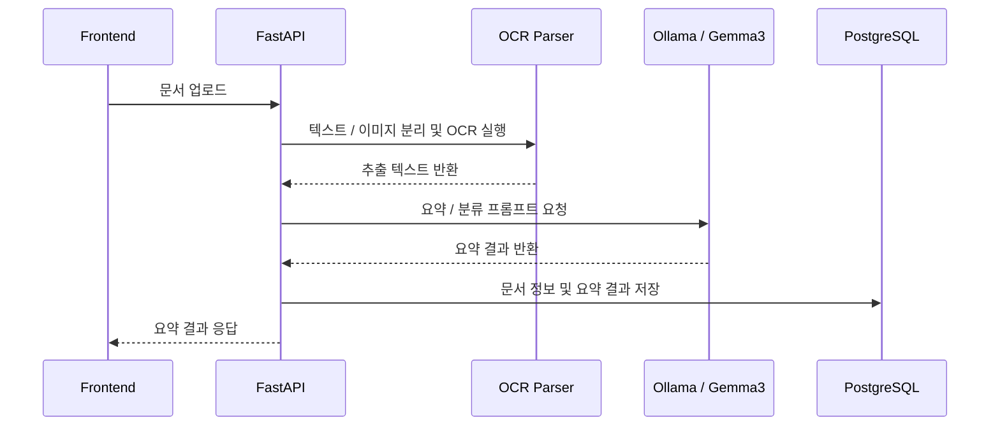

# Brief AI - AI 문서 요약 도우미

> 다양한 문서 파일을 업로드하면 텍스트와 이미지를 분리하고, OCR과 로컬 LLM을 활용해 문서 내용을 요약·분류해주는 AI 문서 처리 서비스입니다.

<br />

## 📌 프로젝트 개요

**Brief AI**는 PDF, 이미지, 문서 파일 등 다양한 형식의 파일을 업로드하면 문서 내부의 텍스트와 이미지 영역을 분석하고, OCR을 통해 텍스트를 추출한 뒤 Ollama 기반 LLM을 통해 요약 결과를 제공하는 웹 서비스입니다.

사용자는 업로드한 문서의 요약 결과를 확인할 수 있으며, 이전에 요약한 문서 이력도 사이드바에서 다시 조회할 수 있습니다.

<br />

## 🎬 시연 영상

[시연 영상 보기](https://drive.google.com/file/d/187Bhly-W698EuUx_w2FVqpRmA1U8iXxu/view?usp=drive_link)

<!--
GitHub에 영상을 직접 업로드한 뒤 아래처럼 교체해도 됩니다.

https://github.com/user-attachments/assets/영상_ID
-->

<br />

## 🛠 기술 스택

| 구분 | 기술 |
| --- | --- |
| Frontend | React, Vite, TypeScript, Axios |
| Backend | FastAPI, Uvicorn, SQLAlchemy |
| Database | PostgreSQL |
| AI / LLM | Ollama, Gemma3:4b |
| OCR / Parsing | PyMuPDF, PaddleOCR, pytesseract, Pillow, OpenCV |
| Infra | Docker, Docker Compose |
| Communication | REST API, WebSocket |

<br />

## ✨ 주요 기능

### 1. 회원가입 / 로그인
- 이메일과 비밀번호 기반 사용자 인증
- 사용자별 업로드 문서 및 요약 이력 구분

### 2. 파일 업로드
- Drag & Drop 방식의 직관적인 파일 업로드
- PDF, 이미지 등 다양한 문서 형식 처리
- 업로드 파일에 대한 요약 요청 생성

### 3. OCR 기반 텍스트 추출
- PyMuPDF를 활용한 PDF 텍스트 및 이미지 추출
- PaddleOCR을 활용한 이미지 영역 내 텍스트 인식
- 문서 내 텍스트 블록과 이미지 블록을 분리하여 처리

### 4. LLM 기반 요약 및 분류
- Ollama를 통해 로컬 환경에서 Gemma3:4b 모델 실행
- 프롬프트 엔지니어링을 통해 요약 결과와 문서 카테고리 생성
- 간략히 / 기본 / 상세히 요약 옵션 제공

### 5. 실시간 작업 상태 확인
- WebSocket을 활용해 OCR 및 LLM 처리 상태를 프론트엔드에 전달
- 문서 분석 진행 상태를 사용자 화면에 실시간 표시

### 6. 요약 이력 관리
- 좌측 사이드바에서 이전 요약 문서 목록 확인
- 선택한 문서의 요약 결과 재조회

### 7. 결과 다운로드
- 요약 결과를 TXT 또는 PDF 형식으로 다운로드

<br />

## 🧩 시스템 흐름



<br />

## 🖥 Frontend 구조

```bash
front-end/
├── public/
├── src/
│   ├── assets/          # 이미지 및 정적 리소스
│   ├── App.tsx          # 메인 애플리케이션 컴포넌트
│   ├── App.css          # 메인 스타일
│   ├── index.css        # 전역 스타일
│   └── main.tsx         # React 진입점
├── package.json
├── vite.config.ts
└── Dockerfile
```

### Frontend 설계 방향

- React + Vite + TypeScript 기반 SPA 구성
- 사용자 인증 상태, 파일 업로드, 요약 결과, 이력 조회 화면 구성
- Drag & Drop 업로드 UI를 통해 사용자 편의성 강화
- Axios 기반 API 통신 구조 적용
- WebSocket을 통해 OCR / LLM 처리 상태를 실시간 표시

<br />

## 🗄 Database 구조

### USER_INFO TABLE

사용자 계정 정보를 저장하는 테이블입니다.

| Column | Type | Description |
| --- | --- | --- |
| USER_ID | UUID, PK | 사용자를 식별하는 고유 ID |
| EMAIL | String, Unique | 사용자 이메일 / 로그인 ID |
| PASSWORD_HASH | String | 비밀번호 해시값 |
| ROLE | String | 사용자 역할(Admin, User) |
| CREATE_AT | DateTime | 계정 생성 시간 |
| UPDATE_AT | DateTime | 정보 수정 시간 |
| IS_ACTIVE | Boolean | 계정 활성 상태 |

### DOCUMENT_RECORDS TABLE

사용자가 업로드한 문서와 AI 요약 결과를 저장하는 테이블입니다.

| Column | Type | Description |
| --- | --- | --- |
| ID | UUID | 요약 이력 ID |
| USER_ID | UUID, FK | 사용자 ID |
| FILE_ID | UUID, PK | 업로드 파일 고유 ID |
| FILE_NAME | String | 사용자가 업로드한 원본 파일명 |
| CATEGORY | Enum | 문서 분류 종류 |
| SUMMARY | Text | AI 요약 결과 |
| UPLOAD_AT | DateTime | 파일 업로드 시간 |
| PROCESS_AT | DateTime | AI 분석 완료 시간 |
| TASK_STATUS | String | 문서 요약 상태 |

### 관계



<br />

## ⚙ Backend 구조

```bash
back-end/
├── app/
│   ├── main.py           # FastAPI 애플리케이션 진입점
│   ├── db.py             # PostgreSQL 연결 설정
│   └── ollama_client.py  # Ollama API 호출 모듈
├── requirements.txt
└── Dockerfile
```

### Backend 처리 흐름



<br />

## 🔄 WebSocket 작업 상태 처리

OCR과 LLM 처리는 시간이 오래 걸릴 수 있으므로, WebSocket을 활용해 작업 진행 상태를 프론트엔드에 전달합니다.

```text
WebSocket 연결
    ↓
asyncio.create_task(process_document)
    ↓
OCR / LLM 작업 백그라운드 실행
    ↓
manager.send()로 진행 상태 전송
    ↓
프론트엔드에서 상태 메시지 표시
```

동기적으로 실행되는 OCR / LLM 작업은 `run_in_threadpool`을 활용해 별도 스레드에서 실행하고, 이벤트 루프는 WebSocket 연결 유지와 상태 전달을 처리하도록 구성했습니다.

<br />

## 🤖 AI / OCR 처리 방식

### PyMuPDF

PDF 문서에서 텍스트와 이미지 정보를 추출하기 위해 사용했습니다. 기존 PyPDF2 사용 시 한글 인코딩 문제가 발생할 수 있어, 텍스트 추출 성능과 안정성이 더 좋은 PyMuPDF를 선택했습니다.

### PaddleOCR

문서 내 이미지 영역에 포함된 텍스트를 인식하기 위해 사용했습니다. 이미지 기반 문서, 캡처된 문서, 스캔 문서에서도 텍스트를 추출할 수 있도록 OCR 처리를 담당합니다.

### Ollama + Gemma3:4b

로컬 환경에서 LLM을 실행하기 위해 Ollama를 사용했고, 문서 요약 및 카테고리 분류에는 Gemma3:4b 모델을 활용했습니다.

프롬프트는 다음과 같은 기준으로 구성했습니다.

- 출력 형식은 JSON 형태로 제한
- category는 지정된 enum 값 중 하나로 제한
- summary는 사용자가 선택한 길이 옵션에 따라 생성
- OCR 노이즈와 불필요한 문서 조각은 무시하도록 지시

<br />

## 🚀 실행 방법

### 1. 저장소 클론

```bash
git clone https://github.com/project-sub/project-sub.git
cd project-sub
```

### 2. Docker Compose 실행

```bash
docker compose up --build
```

### 3. 접속 주소

| 서비스 | 주소 |
| --- | --- |
| Frontend | http://localhost:5173 |
| Backend | http://localhost:8000 |
| PostgreSQL | localhost:5432 |
| Ollama | http://localhost:11434 |

<br />

## 👥 팀 역할

| 이름 | 역할 | 담당 |
| --- | --- | --- |
| 김상수 | Project Leader / Frontend | 프로젝트 관리, 요구사항 정의, 화면 흐름 설계, React UI 개발 |
| 김효영 | Backend Developer | FastAPI 서버 구축, 파일 수신 및 API 설계, PostgreSQL 연동, WebSocket 기반 실시간 상태 전달, asyncio·run_in_threadpool 비동기 처리 |
| 김의수 | AI & Data Engineering | OCR 파싱, PyMuPDF / PaddleOCR 적용, 텍스트 전처리 |
| 김진우 | AI & Data Engineering | Ollama LLM 연동, 프롬프트 엔지니어링, 요약 / 분류 로직 |

<br />

## 📌 프로젝트 회고

OCR과 LLM을 단순히 사용하는 것에 그치지 않고, 문서 업로드부터 텍스트 추출, 이미지 OCR, 프롬프트 설계, 요약 결과 제공까지 이어지는 AI 문서 처리 흐름을 직접 구현하며 실제 서비스 구조를 경험할 수 있었습니다.
